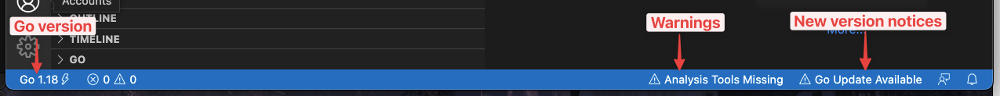
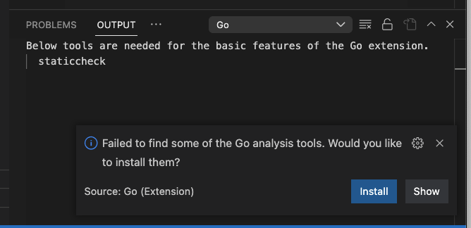

# VSCode Setup

## Extensions

Install the [Go extension by Google](https://marketplace.visualstudio.com/items?itemName=golang.Go):

* Open Visual Studio Code
* Press <kbd>Ctrl</kbd>+<kbd>P</kbd>/<kbd>⌘</kbd>+<kbd>P</kbd> to open the Quick Open dialog
* Type `ext install go` to find the extension
* Click the **Install** button, then the **Enable** button

You should see your status bar updated with some additional information:

The Go Plugin

## Keyboard Shortcuts

* Display documentation tooltip: <kbd>&#8984;</kbd>+<kbd>K</kbd>, <kbd>&#8984;</kbd>+<kbd>I</kbd>

